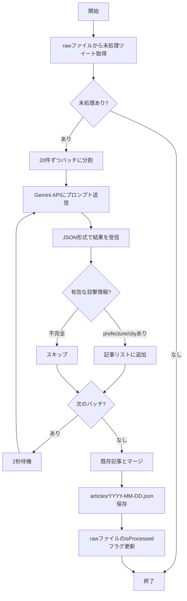

# 目撃情報記事生成フロー

`scripts/generate-articles.js` の処理フロー

## アーキテクチャ図



## 処理の詳細

### 1. 未処理ツイートの取得

```
output/sightings/raw/yahoo-*.json から直近3日分を読み込み
↓
isProcessed: true のツイートを除外
↓
未処理ツイートのリストを作成
```

### 2. Gemini AIによる分析

**入力（20件ずつ）:**
```json
[
  { "id": "123", "text": "渋谷のドンキでボンドロ買えた！", "url": "...", "time": "..." },
  { "id": "456", "text": "どこにも売ってない...", "url": "...", "time": "..." }
]
```

**AIが判定:**
- ツイート123 → 店舗名「ドン・キホーテ」、場所「渋谷」→ 目撃情報として抽出
- ツイート456 → 具体的な店舗なし → 除外

**出力:**
```json
[
  {
    "isSighting": true,
    "prefecture": "東京都",
    "city": "渋谷区",
    "shopName": "ドン・キホーテ渋谷店",
    "shopAddress": "東京都渋谷区...",
    "statusText": "在庫あり"
  }
]
```

### 3. フィルタリング条件

| 条件 | 結果 |
|------|------|
| `isSighting: true` かつ `prefecture` あり かつ `city` あり | 保存 |
| 上記以外 | スキップ |

### 4. 保存

```
articles/2026-04-30.json
├── 既存の記事データ
└── + 新規抽出された記事（sourceUrlで重複除外）
```

## 入出力ファイル

| ファイル | 用途 |
|----------|------|
| `output/sightings/raw/yahoo-*.json` | 入力：収集ツイート（isProcessedフラグで管理） |
| `output/sightings/articles/{日付}.json` | 出力：抽出された記事 |

### isProcessedフラグ

rawファイル内の各ツイートに`isProcessed`フラグを持たせて処理済み管理を行う。

```json
{
  "tweetId": "123456789",
  "text": "...",
  "isProcessed": true  // 処理済みの場合
}
```

## 実行結果の例

```
[Articles] 記事生成開始
[Articles] 処理済み: 0件
[Articles] 未処理ツイート: 105件
[Articles] バッチ 1: 20件を分析中...
[Articles] 有効な目撃情報: 2件
[Articles] バッチ 2: 20件を分析中...
[Articles] 有効な目撃情報: 1件
...
[Articles] 保存: output/sightings/articles/2026-04-30.json (新規: 5件, 合計: 5件)
[Articles] 完了: 105件処理, 5件の目撃情報を抽出
```

## 抽出例

| 元ツイート | 抽出結果 |
|------------|----------|
| "横浜博覧館でボンドロ入荷してた！" | 店舗: 横浜博覧館、住所: 神奈川県横浜市中区山下町145 |
| "諏訪湖SAでご当地シール見つけた" | 店舗: 諏訪湖SA上り線、住所: 長野県諏訪市... |
| "ボンドロどこにも売ってない" | 除外（具体的な店舗情報なし） |
