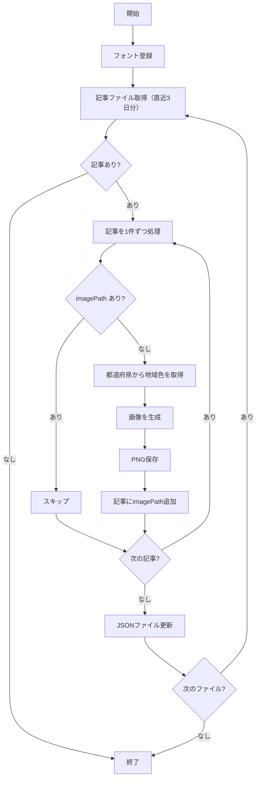

# 目撃情報画像生成フロー

`scripts/sightings/generate-images.js` の処理フロー

## アーキテクチャ図



## 処理の詳細

### 1. 画像生成対象の判定

```
articles/{日付}.json から記事を読み込み
↓
imagePath フィールドがある記事はスキップ
↓
imagePath がない記事のみ画像を生成
```

### 2. 地域カラー設定

| 地域 | 色 | 都道府県 |
|------|-----|----------|
| 北海道・東北 | `#4FC3F7` (水色) | 北海道、青森、岩手、宮城、秋田、山形、福島 |
| 関東 | `#FF6699` (ピンク) | 茨城、栃木、群馬、埼玉、千葉、東京、神奈川 |
| 中部 | `#FF9800` (オレンジ) | 新潟、富山、石川、福井、山梨、長野、岐阜、静岡、愛知 |
| 近畿 | `#BA68C8` (紫) | 三重、滋賀、京都、大阪、兵庫、奈良、和歌山 |
| 中国・四国 | `#4CAF50` (緑) | 鳥取、島根、岡山、広島、山口、徳島、香川、愛媛、高知 |
| 九州・沖縄 | `#EF5350` (赤) | 福岡、佐賀、長崎、熊本、大分、宮崎、鹿児島、沖縄 |

### 3. 画像デザイン

```
┌─────────────────────────────────────┐
│  ████████ 地域カラーの枠線 ████████  │
│  ┌─────────────────────────────┐   │
│  │                             │   │
│  │  ボンボンドロップシール目撃情報   │   │
│  │                             │   │
│  │        山口県・防府市         │   │
│  │                             │   │
│  │       セブン-イレブン         │   │
│  │                             │   │
│  └─────────────────────────────┘   │
└─────────────────────────────────────┘

サイズ: 1200 x 630px（OGP推奨）
```

### 4. imagePath フラグ

生成後、記事JSONに `imagePath` を追加して管理。

```json
{
  "sourceTweetId": "2049812416377319825",
  "prefecture": "山口県",
  "city": "防府市",
  "shopName": "セブン-イレブン",
  "imagePath": "output/sightings/images/2049812416377319825.png"
}
```

## 入出力ファイル

| ファイル | 用途 |
|----------|------|
| `output/sightings/articles/{日付}.json` | 入力：記事データ（imagePathで管理） |
| `output/sightings/images/{tweetId}.png` | 出力：生成された画像 |
| `assets/fonts/keifont.ttf` | フォントファイル |

## 実行結果の例

```
[Images] 画像生成開始
[Images] フォント登録: keifont.ttf
[Images] 読み込み: output/sightings/articles/2026-04-30.json
.....
[Images] 更新: output/sightings/articles/2026-04-30.json

[Images] 完了: 生成 5件 / スキップ 0件
```

2回目の実行（スキップ確認）:
```
[Images] 画像生成開始
[Images] フォント登録: keifont.ttf
[Images] 読み込み: output/sightings/articles/2026-04-30.json

[Images] 完了: 生成 0件 / スキップ 5件
```
