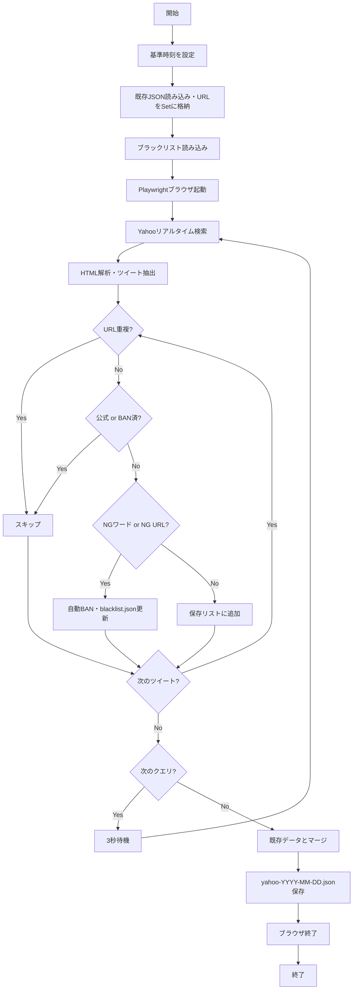

# X目撃情報収集フロー

`scripts/scrape-yahoo.js` の処理フロー

## アーキテクチャ図



### フィルタ設定（config/sightings.json）

**NGワード** - これらを含むツイートは自動BAN

| ワード |
|--------|
| プレゼント |
| 懸賞 |
| 当選 |
| 応募 |
| キャンペーン |

**NG URL** - これらを含むツイートは自動BAN

| URL |
|-----|
| amzn.to |
| rakuten.co.jp |
| r10.to |
| afl.rakuten |

**公式アカウント** - 除外（BANはしない）

現在は未設定。設定例: `["bonbon_drop"]`

### 自動BANの例

```
ツイート: "ボンドロシール プレゼント企画！フォロー&RTで..."
         ↑ NGワード「プレゼント」を含む

→ 自動BAN
→ blacklist.jsonに追加:
  {
    "userId": "spammer123",
    "reason": "NGワード: プレゼント",
    "createdAt": "2026-04-30T22:44:00+09:00"
  }

→ 次回以降、このユーザーのツイートは全てスキップ
```

## 重複チェックの仕組み

**URLベースで重複を判定**

同じツイートURL → スキップ（保存しない）
異なるツイートURL → 保存する

### 具体例

```
【1回目の実行】
既存URLセット: 空

取得: ツイートA (x.com/.../status/111) → 新規 → 保存
取得: ツイートB (x.com/.../status/222) → 新規 → 保存

保存後のURLセット: {111, 222}
```

```
【2回目の実行（同じ日）】
既存URLセット: {111, 222}  ← 1回目で保存したもの

取得: ツイートA (x.com/.../status/111) → 既存にある → スキップ
取得: ツイートB (x.com/.../status/222) → 既存にある → スキップ
取得: ツイートC (x.com/.../status/333) → 新規 → 保存

保存後のURLセット: {111, 222, 333}
```

```
【翌日の実行】
ファイルが変わる（yahoo-2026-05-01.json）
既存URLセット: 空  ← 新しい日のファイルはまだない

取得: ツイートA (x.com/.../status/111) → 新規 → 保存
※ 前日のファイルは参照しないので、同じツイートでも保存される
```

## 入出力ファイル

| ファイル | 用途 |
|----------|------|
| `config/sightings.json` | 検索クエリ、NGワード、公式アカウント |
| `output/sightings/raw/yahoo-{日付}.json` | 既存データ（重複チェック用） |
| `output/sightings/blacklist.json` | BANユーザーリスト |

## データ構造

### ツイート1件

```json
{
  "tweetId": "2049845294402248857",
  "userId": "atyaaaaaa",
  "text": "ボンボンドロップシールを見かけた...",
  "user": "しょーが",
  "time": "2026-04-30T22:36:00.000+09:00",
  "timeRaw": "8分前",
  "url": "https://x.com/atyaaaaaa/status/2049845294402248857",
  "hashtags": ["#ボンドロ"],
  "images": ["https://..."]
}
```

### ブラックリスト1件

```json
{
  "userId": "spammer123",
  "reason": "NGワード: プレゼント",
  "createdAt": "2026-04-30T22:44:00.000+09:00"
}
```

## 実行結果の例

```
[Yahoo] 処理開始
[Yahoo] 既存URL数: 41        ← 今日すでに41件保存済み
[Yahoo] ブラックリスト: 14件
[Yahoo] クエリ数: 3
[Yahoo] 検索: "ボンボンドロップ" ("入荷" OR "在庫"...
[Yahoo] 取得: 41件
.....[AutoBAN] spammer123 (理由: NGワード: プレゼント)
..........
[Yahoo] 完了: 取得 122件 / 新規 105件 / BAN 2件 / スキップ 15件
                              ↑新規保存    ↑自動BAN  ↑重複スキップ
```
